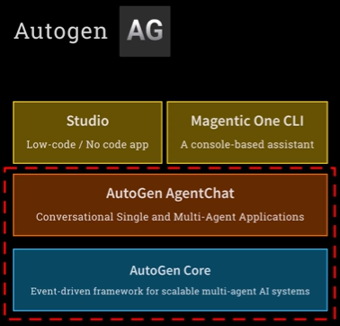
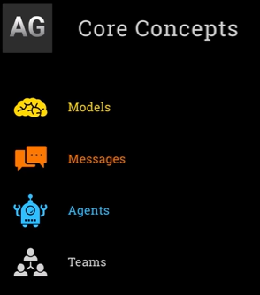

## 🧠 What Is Microsoft Autogen?

**Autogen** is an **open-source framework by Microsoft** for building **multi-agent AI systems** — where multiple AI agents can talk to each other, use tools, and solve tasks collaboratively.

---

## 🚀 Why Learn Autogen?

You might be thinking:
> “Another framework? I just want to get to MCP in Week 6!”

But here’s the good news:
- ✅ **Autogen is quick to learn** — it shares concepts with LangChain and LangGraph.
- ✅ **This week is lighter** — it’s a fast-paced intro.
- ✅ **You’ll get a sneak peek of MCP** this week too!

---

## 🆕 What’s New in Autogen?

### 🔄 Version History
- **Autogen 0.2**: The older version, simpler but limited.
- **Autogen 0.4+**: A **complete rewrite** with:
  - **Async, event-driven architecture**
  - Better **observability** (you can see what agents are doing)
  - More **control and scalability**

### 📦 Current Version: `0.5.1` (as of now)

---

## ⚔️ The Drama: Autogen vs AG2

### 🧩 What Happened?
- The **original creators of Autogen** left Microsoft.
- They **forked** the project and created a new version called:
  - **AG2** (Autogen Gen 2)
  - Also known as **AgentOS 2**

### 🔄 Key Differences:
| Feature | Microsoft Autogen | AG2 (Forked Version) |
|--------|-------------------|----------------------|
| Based on | Autogen 0.4+ | Autogen 0.2 |
| Maintained by | Microsoft | Original creators (now at Google) |
| PyPI Package | `autogen` (confusingly points to AG2!) | Same name |
| Community | Larger, enterprise-focused | Fast-moving, open-source focused |

> ⚠️ **Important**: If you run `pip install autogen`, you get **AG2**, not Microsoft’s version!

---

## ✅ What Are You Using in This Course?

You are using:
- **Microsoft Autogen (v0.5.1)** — the official, latest version.
- Your environment is pre-configured to avoid confusion with AG2.

---

## 🧪 Example Use Case

Let’s say you want to build an AI system that:
1. **Reads a document**
2. **Summarizes it**
3. **Checks if the summary meets quality standards**
4. **Asks the user for clarification if needed**

With Autogen, you can:
- Create a **reader agent**
- Create a **summarizer agent**
- Create an **evaluator agent**
- Let them **talk to each other** and **loop** until the task is done well

---

## 🧠 Final Thoughts

- Autogen is a **powerful framework** for building **agentic workflows**.
- It’s **modular**, **scalable**, and **enterprise-ready**.
- Understanding the **Autogen vs AG2** split helps you avoid confusion when reading docs or installing packages.

---

## 🧠 What Is Autogen?

**Autogen** is an **open-source framework by Microsoft** for building **multi-agent AI systems** — where multiple AI agents (like chatbots, tools, evaluators) can work together to solve complex tasks.

---

## 🧱 Autogen Is Made of Several Parts

### 1. **Autogen Core**
- A **runtime system** for managing how agents talk to each other.
- Think of it as the **engine** that powers agent communication.
- It’s **framework-agnostic** — works with any LLM or tool.

> 🧠 Example: If you have 3 agents (a planner, a coder, and a tester), Core handles their messaging and coordination.

---

### 2. **Autogen AgentChat**
- A **lightweight framework** for building agents that:
  - Use LLMs
  - Call tools
  - Talk to each other
- Similar to **LangChain**, **CrewAI**, or **OpenAI’s Agents SDK**.

> 🧠 Example: You can create a “Research Agent” that uses GPT-4 and a “Summarizer Agent” that condenses the findings.

---

### 3. **Autogen Studio**
- A **low-code/no-code** visual builder for agents.
- Great for non-coders or quick prototyping.
- Not production-ready — more for experimentation.

---

### 4. **Magentic One**
- A **command-line tool** to run pre-built agent workflows.
- Like a packaged version of what you’ve been building manually.

---




---



## ⚠️ Important: Autogen vs AG2

| Feature | Microsoft Autogen | AG2 (Forked Version) |
|--------|-------------------|----------------------|
| Maintained by | Microsoft | Original creators (now at Google) |
| Based on | New architecture (0.4+) | Older version (0.2) |
| PyPI package | `autogen` (confusingly points to AG2!) | Same |
| Focus | Enterprise, research | Fast-moving, open-source |

> ✅ You are using **Microsoft Autogen v0.5.1**, pre-installed in your environment.

---

## 🧩 Core Concepts in Autogen AgentChat

| Concept | Description | Example |
|--------|-------------|---------|
| **Model** | The LLM used by an agent | GPT-4, Claude, etc. |
| **Message** | Any communication between agents or tools | “Summarize this article” |
| **Agent** | A unit that uses a model to perform tasks | A summarizer, a planner |
| **Team** | A group of agents working together | Planner + Coder + Tester |

---

## 🧪 Example Use Case

Let’s say you want to:
1. Ask a question about a database
2. Have an agent write a SQL query
3. Have another agent run the query and return results

With Autogen AgentChat, you can:
- Create a **Query Agent** (uses GPT-4 to write SQL)
- Create a **Database Agent** (executes SQL and returns results)
- Let them **talk to each other** and solve the task

---

## 🧭 What You’ll Focus On

You’ll mostly work with:
- ✅ **Autogen Core** (for agent communication)
- ✅ **Autogen AgentChat** (for building agents)

You’ll skip:
- ❌ Studio (no-code)
- ❌ Magentic One (CLI tool)

---

## 🧠 **What is Autogen Agent Chat?**
Autogen Agent Chat is a framework that lets you build **AI agents** that can:
- Use large language models (LLMs) like GPT-4
- Send and receive messages
- Use tools (like databases or APIs)
- Work like a team of agents

---

## 🧩 **Key Concepts with Examples**

### 1. **Model**
This is the LLM (like GPT-4) that powers your agent.

```python
from autogen import OpenAIChatCompletionClient

model_client = OpenAIChatCompletionClient(model="gpt-4-mini")
```

You can also use local models like LLaMA in the same way.

---

### 2. **Message**
A message is a piece of text from a user or agent.

```python
from autogen import TextMessage

msg = TextMessage(content="I'd like to go to London", role="user")
print(msg)
```

Output:
```
TextMessage(role='user', content="I'd like to go to London")
```

---

### 3. **Agent**
An agent is an AI assistant with a personality and purpose.

```python
from autogen import AssistantAgent

agent = AssistantAgent(
    name="airline_agent",
    model=model_client,
    system_message="You are a helpful assistant for an airline. You give short humorous answers.",
    stream=True
)
```

---

### 4. **Running the Agent**
You send messages to the agent using `on_messages`.

```python
from autogen import CancellationToken
import asyncio

token = CancellationToken()

response = await agent.on_messages([msg], token)
print(response.chat_messages[-1].content)
```

Example output:
```
Great choice! If it starts raining, it's just London saying hello!
```

---

### 5. **Adding Tools (e.g., Database Access)**
You can give your agent tools like a function to look up ticket prices.

#### Step 1: Create a SQLite database

```python
import sqlite3
import os

if os.path.exists("tickets.db"):
    os.remove("tickets.db")

conn = sqlite3.connect("tickets.db")
cursor = conn.cursor()
cursor.execute("CREATE TABLE cities (name TEXT, price INTEGER)")
cursor.executemany("INSERT INTO cities VALUES (?, ?)", [
    ("London", 299),
    ("Paris", 399),
    ("Rome", 499),
])
conn.commit()
conn.close()
```

#### Step 2: Define a tool (function)

```python
def get_city_price(city_name: str) -> int:
    """Get round trip ticket price to a city."""
    conn = sqlite3.connect("tickets.db")
    cursor = conn.cursor()
    cursor.execute("SELECT price FROM cities WHERE name=?", (city_name,))
    result = cursor.fetchone()
    conn.close()
    return result[0] if result else "City not found"
```

#### Step 3: Create a smart agent with the tool

```python
smart_agent = AssistantAgent(
    name="smart_agent",
    model=model_client,
    system_message="You are a helpful assistant for an airline. You can look up ticket prices.",
    tools=[get_city_price],
    stream=True,
    reflect_on_tool_use=True
)
```

#### Step 4: Run the smart agent

```python
response = await smart_agent.on_messages([msg], token)
print(response.chat_messages[-1].content)
```

Example output:
```
A round trip ticket to London will set you back 299. Don’t forget your umbrella!
```

---

## ✅ **Why This Is Cool**
- You can build powerful agents with just a few lines of code.
- You can plug in tools like databases or APIs easily.
- It’s lightweight and beginner-friendly.

---