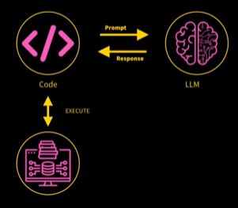

# Agentic AI

## Ambiguity on what Agents actually are:
AI agents are programs where LLM outputs control the workflow.

In practice, it describes an AI solution that involves any or all of these:
#### 1. Multiple LLM calls: 
                 Solutions that involve multiple LLM calls.
#### 2. LLMs with ability to use tools:
                 LLMs using tools to perform tasks (like controlling lights).
#### 3. An environment where LLMs interact: 
                 Environments where LLMs can communicate and coordinate.
#### 4. A planner to coordinate activities: 
                The presence of a planner that organizes activities.
#### 5. Autonomy:
                Autonomy, where LLMs can decide the order of their actions.

## Agentic System:
Anthropic distinguishes two types:
#### 1. Workflow:
               Workflows where LLMs and tools are orchestrated through predefined code paths.
#### 2. Agents:  
              Agents are systems where LLMs dynamically direct their own processes and tool usage, maintaining control over how they accomplish tasks.

## Workflow Design Patterns:
### 1. Prompt Chaining:
Decompose into fixed sub-tasks

                IN -> LLM1 -> Gate -> LLM2 -> LLM3 -> OUT

This pattern involves setting up a sequence of LLM calls where the output of one model directly becomes the input for the next. This method ensures that tasks are precisely framed, allowing for accurate responses and maintaining a structured workflow. The speaker notes that while this behaves like a workflow, it can also show elements of autonomy since the initial LLM influences the subsequent tasks.

### 2. Routing:
Direct an input into a specialized sub-task ensuring separation of concerns

                                -> LLM1
                IN -> LLM Route -> LLM2  -> OUT
                                -> LLM3

In this design, an LLM decides which specialized model is best suited for a specific task. This separation allows different LLMs to utilize their unique expertise, effectively routing tasks to the right model. The speaker suggests that routing demonstrates autonomy as the router makes informed decisions based on incoming input.

### 3. Parallelization:
Breaking down tasks and running multiple subtasks concurrently

                                -> LLM1
                IN -> Coordinator -> LLM2  -> Aggregator -> OUT
                                -> LLM3

This involves breaking a task into smaller components that can be executed simultaneously. Here, a code orchestrator manages the parallel execution across multiple LLMs, which might be applying different tasks or running the same task concurrently for more reliable results. The aggregation of these results showcases the effectiveness and efficiency of this approach.

### 4. Orchestrator-Worker:
Complex tasks are broken down dynamically and combined

                                -> LLM1
        IN -> Orchestrator -> LLM2  -> Synthesizer -> OUT
                                -> LLM3

Similar to parallelization, this design pattern has an LLM functioning as an orchestrator, breaking down complex tasks and assigning subtasks to various LLMs. This model indicates a dynamic system where the orchestrator selects how tasks are distributed. The speaker highlights the overlap between workflows and agent patterns in this context.

### 5. Evaluator-Optimizer:
LLM output is validated by another

    IN -> LLM Generator --Solution---> <---Rejected with feedback---LLM Evaluator --Accepted--> OUT 

In this setup, one LLM generates a solution while another evaluates the output for accuracy. The evaluator can accept or reject the work and provide feedback for improvement. This iterative feedback loop is essential for enhancing the reliability and quality of AI systems, making it a vital design pattern.

## By Contrast, Agents:
1. Open-ended
2. Feedback loops
3. No fixed path 

### Characteristics of Agents:
#### 1. Open-ended: 
    Agents operate without predetermined sequences, allowing them to adapt to various situations and queries. They can tackle a wide range of problems rather than following a fixed script.

#### 2. Feedback loops: 
    Agents utilize feedback from previous actions to improve future responses. This iterative process helps them learn and refine their approaches based on user interactions and environmental changes.

#### 3. No fixed path: 
    Unlike workflows that have a defined order, agents can take different routes to achieve their goals. This lack of a predetermined path allows for more flexible problem-solving.

### Interaction Model:
    HUMAN -> LLM Call  ----Action---> <--Feedback--- Environment 
                            -> STOP

### Risks of Agent Framework:
####  1. Unpredictable path: 
    Since agents do not have a fixed sequence of actions, the order and type of tasks they execute can vary greatly. This unpredictability can lead to unexpected results, making it challenging to control outcomes.

#### 2. Unpredictable output: 
    An agent's responses can vary based on its learned experiences and environmental feedback, which means the output may not always be reliable or consistent.

#### 3. Unpredictable costs: 
    The dynamic nature of agents can result in varying operational costs. Since you can't predict how long an operation will take, expenses related to LLM calls can escalate unexpectedly.

#### 4. Monitor: 
    Continuous monitoring of agent interactions is crucial for understanding performance patterns and ensuring that the system operates within the desired parameters.

#### 5. Guardrails: 
    Implementing guardrails is necessary to keep agents aligned with intended behavior and objectives. These safeguards help mitigate risks associated with unpredictability, ensuring agents operate safely and consistently within predefined boundaries.

Calling Multiple LLM's:
The cast of characters
#### Open AI: 
    gpt-4o-mini (alos gpt-4o, o1, o3-mini)
#### Anthropic: 
    Claude-3-7-Sonnet
#### Google: 
    Gemini-2.0-flash
#### DeepSeek AI: 
    DeepSeek V3, DeepSeek R1
#### Groq: 
    Open-source LLMs including Llama3.3
#### Ollama: 
    local open-source LLMs including Llana3.2

#### OpenAI - gpt-4o-mini (also gpt-4o, o1, o3-mini):
    GPT-4o-mini is one of the more compact variants of OpenAI's GPT-4 model. It is well-known for its natural language processing capabilities and is often preferred when resources are limited or simplicity is preferred. The "o1" and "o3-mini" versions also provide various configurations tailored for specific tasks or performance requirements.

#### Anthropic - Claude-3-7-Sonnet:
    Claude is a model developed by Anthropic, a company formed by some former OpenAI engineers. Claude-3-7-Sonnet focuses on enhanced reasoning capabilities, making it suitable for tasks requiring critical thinking or more complex queries.

#### Google - Gemini-2.0-flash:
    Gemini-2.0-flash is part of Google's suite of AI models. While specifics can vary, Google’s models are often designed for fast processing speeds and integration into broader ecosystems, emphasizing their use in applications such as search and AI-driven responses.

#### DeepSeek AI - DeepSeek V3, DeepSeek R1:
    DeepSeek AI has developed its models with different focuses, with the versions indicating progress and enhancements in their architecture. These models could be adapted for various applications, depending on the intended task.

#### Groq - Open-source LLMs including Llama3.3:
    Groq is known for its contributions to open-source models, specifically Llama3.3. Open-source models allow for greater community engagement and customization, providing flexibility for developers.

#### Ollama - Local open-source LLMs including Llana3.2:
    Ollama offers local versions of LLMs, such as Llana3.2, which can be run on personal servers or machines. This allows developers to utilize LLMs without relying on cloud-based solutions, offering privacy and control over data.

Each model provides unique strengths and operational characteristics, helping practitioners choose the best fit depending on the application's specific requirements, computing resources, and cost considerations. This diversified landscape of LLMs showcases the evolving nature of AI technology and the options available for developers.

Agentic AI Frameworks:
 -----------   ---------
| LangGraph | | AutoGen |
 -----------   ---------
 -------------------    -------
| OpenAI Agents SDK | |Crew AI|
 ------------------    -------
 --------------   -----
| No Framework | | MCP |
 --------------   -----
 
#### LangGraph: 
    LangGraph is a sophisticated and powerful framework designed for complex AI architectures. It facilitates seamless integration between models and data sources without requiring extensive coding, allowing for a more dynamic and flexible setup. However, it's noted for being complex and may not suit every project, particularly those requiring lightweight solutions.

#### AutoGen: 
    This framework combines various functionalities and is tailored to enhance agent interaction and performance. It is recognized as powerful and offers capabilities that allow developers to create efficient AI systems. AutoGen's flexibility enables it to support diverse use cases effectively.

#### OpenAI Agents SDK: 
    One of the simplest and cleanest frameworks, the OpenAI Agents SDK is lightweight and flexible, making it an excellent choice for developers who prefer minimal overhead. It is relatively new and has garnered appreciation for its elegant design. As mentioned by Ed Donner, it is suitable for production but requires developers to implement monitoring and guardrails.

#### Crew AI: 
    Crew AI is favored for its low-code approach, allowing developers to create agent solutions with ease through simple configurations. It strikes a balance between coding and user-friendliness, making it popular among users looking for effective yet straightforward implementations.

#### No Framework: 
    This category represents scenarios where developers might choose not to use a specific framework, thereby focusing on direct model interactions without added layers of complexity. This could be beneficial for specific tasks or prototypes that require simplicity.

#### MCP (Model Control Protocol): 
    Although not categorized strictly as a framework, MCP is essential for connecting agents to tools and resources, facilitating communication in a controlled manner, and enhancing the agent's capabilities.

Model Context Protocols: Open source 

Many, many more! Which to pick depends on the use case and your preference

#### Resources:
    We can privde an LLM with resources to improve its expertise
    Baiscally, this just means shoving data relevant to the question into the prompt.

There are techniques like RAG to get really smart st picking relevant content.

#### Tools: 
    Tools give LLMs automony...
    Give an llm the power to carry out actions like query a database or message other LLMs

Sounds spooky, right? Open AI can reach into my computer ?

The reality is a bit mundane.

Tool Calling - in theory
An llm can reach into my computer

code -> prompt<-respose-> LLM <> Execute 

