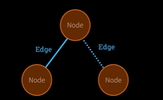
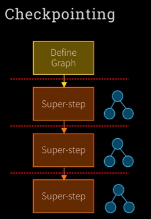
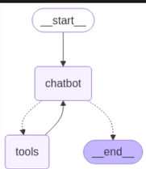

## 🧠 **Week 4 Overview: LangGraph and the LangChain Ecosystem**

## 🧩 **LangChain Ecosystem Breakdown**

### 1. **LangChain**
- **Purpose**: Abstraction framework for working with LLMs.
- **Key Features**:
  - API abstraction (e.g., switching from GPT to Claude).
  - Chaining LLM calls.
  - RAG (Retrieval-Augmented Generation) support.
  - Prompt templates and memory management.
  - Declarative language: **LCL**.
- **Pros**:
  - Rapid development (e.g., RAG in 4 lines).
  - Rich ecosystem and tooling.
- **Cons**:
  - Opinionated abstractions.
  - Less transparency into prompt logic.
  - May be overkill for simple use cases.

### 2. **LangGraph**
- **Not dependent on LangChain**, but can integrate with it.
- **Purpose**: Build **resilient, scalable, repeatable** agent workflows.
- **Core Concept**: Workflows as **graphs** (tree of nodes).
- **Key Features**:
  - Human-in-the-loop.
  - Multi-agent collaboration.
  - Memory and conversation history.
  - **Time travel** (checkpointing and rollback).
  - Fault-tolerant scalability.
- **Use Case**: Ideal for complex, interconnected agentic systems.

### 3. **LangSmith**
- **Purpose**: Monitoring and debugging tool.
- **Works with**: LangChain and LangGraph.
- **Features**:
  - Visibility into LLM calls.
  - Debugging reasoning and failures.

---

## 🧭 **Why Use LangGraph?**
- Designed for **modern agentic AI** needs.
- Focuses on **stability**, **observability**, and **scalability**.
- Encourages **graph-based thinking** for workflows.
- Integrates with LangSmith for monitoring.

---

## 🧠 **LangGraph: A Deeper Dive into the Ecosystem**

### 🧱 **Three Components of LangGraph**
LangGraph is not just a single tool—it’s a **suite of three interconnected offerings**:

1. ### **LangGraph (Framework)**
   - The **core open-source library**.
   - Used to build **agentic workflows** using a **graph-based model**.
   - Analogous to **Crew’s framework**.
   - Focused on **developer control**, **resilience**, and **repeatability**.

2. ### **LangGraph Studio**
   - A **visual interface** for building and managing LangGraph workflows.
   - Similar to **Crew Studio**.
   - Enables **drag-and-drop** style development for non-coders or rapid prototyping.

3. ### **LangGraph Platform**
   - A **hosted, enterprise-grade deployment environment**.
   - Offers **scalability**, **fault tolerance**, and **integration hooks**.
   - Analogous to **Crew Enterprise**.
   - Promoted heavily on the website—likely the **commercial focus** of the LangChain team.

---

## 🧭 **Anthropic’s Perspective on Frameworks**

### 📄 **Key Takeaways from Anthropic’s Blog Post: “Building Effective Agents”**
- Anthropic recommends **starting with direct API usage**.
- Frameworks like LangGraph are helpful but can:
  - **Obscure prompts and responses**.
  - **Add unnecessary complexity**.
  - **Encourage overengineering**.
- Their advice:
  > “Start by using LLM APIs directly. Many patterns can be implemented in a few lines of code.”

### 🧠 **Design Philosophy Clash**
- **LangGraph**: Emphasizes **structure**, **abstraction**, and **scalability**.
- **Anthropic**: Emphasizes **simplicity**, **transparency**, and **direct control**.


---

## 🧠 **LangGraph Core Concepts & Terminology**

LangGraph introduces a **graph-based model** for building agent workflows. Here's the essential terminology:

### 🔷 1. **Graph**
- A **workflow structure** composed of nodes and edges.
- Represents the **flow of logic** in your agent system.
- Think of it like a **tree or flowchart** of operations.

---

### 🟡 2. **State**
- A **shared object** that holds the **current snapshot** of your application.
- Passed between nodes and updated as the workflow progresses.
- Treated as **immutable**: each node returns a **new state**, not a modified one.

---

### 🔵 3. **Node**
- A **Python function** that performs a task.
- Receives the current state → performs logic (e.g., LLM call, file write) → returns a new state.
- Represents **agent logic** or operations.

---

### 🟠 4. **Edge**
- A **Python function** that determines the **next node** to execute.
- Can be:
  - **Simple**: always go to the next node.
  - **Conditional**: choose the next node based on the current state.
- Represents **control flow** between operations.

---

## 🛠️ **LangGraph Workflow: Two-Phase Execution**

LangGraph applications run in **two distinct phases**:

### 🧩 Phase 1: **Graph Definition**
This happens at runtime but before execution begins.

#### 🪜 Five Steps to Build a Graph:
1. **Define the State Class**
   - A class that defines what data your state will hold.
   - Associated with a **reducer** (explained in the next session).

2. **Start the Graph Builder**
   - Initializes the graph layout process.

3. **Create Nodes**
   - Define Python functions that represent tasks.

4. **Create Edges**
   - Define how nodes are connected and what happens next.

5. **Compile the Graph**
   - Finalizes the structure and prepares it for execution.

---

### 🚀 Phase 2: **Graph Execution**
- After compiling, the graph is **invoked**.
- Nodes execute in order, passing and updating the state.
- The system follows the logic defined by edges.

---

## 🧠 **Mental Model Recap**
- **Nodes** = Do the work (functions).
- **Edges** = Decide what happens next (control flow).
- **State** = The evolving data passed between nodes.
- **Graph** = The full blueprint of your agent system.

---

## 🖼️ **Visual Representation**
Imagine a diagram with:
- **Three orange circles (nodes)**: each representing a task.
- **Arrows (edges)**: connecting nodes, some conditional.
- **State**: flowing through the graph, updated at each step.



---

## 🧠 **LangGraph Recap & Deep Dive: State and Reducers**

### 🔁 **Quick Recap of LangGraph Core Concepts**
- **Graph**: Represents the agent workflow (like a tree).
- **State**: Snapshot of the system at any point in time.
- **Node**: A Python function that performs a task and returns a new state.
- **Edge**: A Python function that decides what node to run next based on the current state.

---

## 📦 **Understanding State in LangGraph**

### 🟡 What is State?
- A **shared object** that holds the **current data** of your application.
- Passed between nodes and **updated immutably**.
- Think of it as a **snapshot** of the world at a given moment.

### 🔒 What Does “Immutable” Mean?
- Once a state object is created, **it cannot be changed**.
- Instead of modifying it, you **create a new state object** with updated values.
- This ensures:
  - **Consistency** (you can always go back to a previous state).
  - **Predictability** (no side effects).
  - **Concurrency safety** (multiple nodes can run in parallel).

---

## 🧮 **Example: Counting Node**
```python
def my_counting_node(state):
    new_count = state.count + 1
    return State(count=new_count)
```
- Takes in `state` with a `count` field.
- Returns a **new state** with `count` incremented.
- Does **not** modify the original state.

---

## 🧩 **What is a Reducer?**

### 🔧 Reducer Function
- A **special function** associated with a field in the state.
- Tells LangGraph **how to combine** values for that field when **multiple nodes** return updates **at the same time**.

### 🧠 Why Use Reducers?
- In concurrent execution, multiple nodes may return different updates to the same field.
- A reducer ensures these updates are **merged correctly**.
- Prevents one update from **overwriting** another.

### 📌 Example Use Case
- If two nodes both update a `messages` list:
  - A reducer could **append** both updates instead of replacing one with the other.

---

## 🛠️ **LangGraph Execution Flow (Revisited)**

### 🪜 Five Steps to Build a Graph:
1. **Define the State Class** (with optional reducers).
2. **Start the Graph Builder**.
3. **Create Nodes** (functions that do work).
4. **Create Edges** (functions that decide what’s next).
5. **Compile the Graph** (prepare it for execution).

### ⚙️ Two Phases of Execution:
1. **Graph Building Phase**: Define structure and logic.
2. **Graph Execution Phase**: Run the compiled graph.

---

## 🧠 **LangGraph Lab 1: Key Concepts Recap**

### 🧩 **LangGraph Workflow Recap**
- **Graph** = Agent workflow (like a tree).
- **State** = Snapshot of the system at any point.
- **Node** = Python function that does work and returns a new state.
- **Edge** = Python function that decides what node runs next.

---

## 🪜 **Five Steps to Build a LangGraph**
1. **Define the State Class**
2. **Start the Graph Builder**
3. **Create Nodes**
4. **Create Edges**
5. **Compile the Graph**

---

## 📦 **Step 1: Define the State Class**

### ✅ Use `pydantic.BaseModel` to define state
- Common and convenient for structured data.

### 🟡 Example:
```python
from pydantic import BaseModel
from typing import Annotated, List
from langgraph.graph.message import add_messages

class State(BaseModel):
    messages: Annotated[List[str], add_messages]
```

### 🔍 What’s Happening?
- `messages` is a list of strings.
- `Annotated` adds metadata (ignored by Python, used by LangGraph).
- `add_messages` is a **reducer** that merges message lists.

---

## 🔁 **What is a Reducer?**
- A function that **merges updates** to a field when multiple nodes run in parallel.
- Prevents one update from **overwriting** another.
- `add_messages` simply **concatenates lists** of messages.

---

## 🧱 **Step 2: Start the Graph Builder**

### ✅ Use `StateGraph` to begin building:
```python
from langgraph.graph import StateGraph

builder = StateGraph(State)
```

- Pass the **class**, not an instance.
- This begins the **graph definition phase**.

---

## 🧠 **Bonus: Python Type Hints & `Annotated`**
- `Annotated` lets you attach **extra info** to a type.
- LangGraph uses this to know which **reducer** to apply.
- Example:
```python
text: Annotated[str, "Something to be shouted"]
```

---

## 🧠 **LangGraph Lab 1: Node, Edges & Running the Graph**

### 🪜 **Recap: Five Steps to Build a LangGraph**
1. **Define the State Class**
2. **Start the Graph Builder**
3. **Create Nodes**
4. **Create Edges**
5. **Compile the Graph**

---

## 🔧 **Step 3: Create a Node**

### ✅ What is a Node?
- A **Python function** that:
  - Takes in the current **state**.
  - Returns a **new state** (immutably).
- Can do anything: call an LLM, generate text, or just return data.

### 🧪 Example Node:
```python
def our_first_node(state):
    reply = f"{random.choice(nouns)} are {random.choice(adjectives)}"
    messages = [AIMessage(content=reply)]
    return State(messages=messages)
```

- Generates a random sentence.
- Wraps it in a message.
- Returns a new `State` object.

### ➕ Add Node to Graph:
```python
graph.add_node("first_node", our_first_node)
```

---

## 🔗 **Step 4: Create Edges**

### ✅ What is an Edge?
- Defines the **flow** between nodes.
- Can be **simple** (always go next) or **conditional**.

### 🧪 Example Edges:
```python
graph.add_edge("start", "first_node")
graph.add_edge("first_node", "end")
```

- `start` and `end` are special constants from LangGraph.
- This creates a simple linear flow: **start → first_node → end**

---

## 🧱 **Step 5: Compile the Graph**
```python
app = graph.compile()
app.get_graph().print_ascii()
```

- Finalizes the graph.
- Displays a visual layout (ASCII diagram).

---

## 🚀 **Running the Graph with Gradio**

### ✅ Create a Chat Function:
```python
def chat(user_input, history):
    messages = [HumanMessage(content=user_input)]
    state = State(messages=messages)
    result = app.invoke(state)
    return result.messages[-1].content
```

- Wraps user input in a message.
- Creates a `State` object.
- **Invokes** the graph with that state.
- Returns the latest message.

### 🖥️ Launch with Gradio:
```python
gr.ChatInterface(chat).launch()
```

---

## 🧠 **Key Takeaways**
- Nodes are just Python functions that return new state.
- Edges define the flow between nodes.
- Reducers (like `add_messages`) help merge state updates.
- LangGraph is **not tied to LLMs**—you can use it for any logic.

---

## 🧠 LangGraph with a Real LLM – Key Concepts

### ✅ Goal
Build a simple chatbot using LangGraph and a real LLM (OpenAI via LangChain).

---

## 🪜 Step-by-Step Breakdown

### 1. **Define the State**
```python
class State(BaseModel):
    messages: Annotated[List[BaseMessage], add_messages]
```
- Holds a list of messages (user + AI).
- Uses `add_messages` reducer to concatenate messages.

---

### 2. **Start the Graph Builder**
```python
builder = StateGraph(State)
```
- Initializes the graph with the state class.

---

### 3. **Create the LLM**
```python
llm = ChatOpenAI()
```
- Uses LangChain’s `ChatOpenAI` to connect to OpenAI’s chat models.
- You can use other LLMs or call APIs directly if preferred.

---

### 4. **Define the Node**
```python
def chatbot_node(state):
    response = llm.invoke(state.messages)
    return State(messages=[response])
```
- Takes in the current state.
- Sends messages to the LLM.
- Returns a new state with the LLM’s response.

---

### 5. **Add Node to Graph**
```python
builder.add_node("chatbot", chatbot_node)
```

---

### 6. **Add Edges**
```python
builder.add_edge("start", "chatbot")
builder.add_edge("chatbot", "end")
```
- Simple linear flow: start → chatbot → end.

---

### 7. **Compile the Graph**
```python
app = builder.compile()
```
- Finalizes the graph for execution.

---

## 💬 Gradio Chat Interface

### Chat Function
```python
def chat(user_input, history):
    messages = [HumanMessage(content=user_input)]
    state = State(messages=messages)
    result = app.invoke(state)
    return result.messages[-1].content
```
- Wraps user input in a message.
- Invokes the graph.
- Returns the LLM’s response.

---

## 🧪 Observations

- The chatbot works and responds using OpenAI.
- However, it does **not retain memory** between turns.
- Each invocation is **stateless**—only the latest message is passed.

### Example:
```plaintext
User: My name is Ed.
AI: Nice to meet you, Ed.
User: What's my name?
AI: I'm sorry, I don't have access to your personal data.
```

---

## 🔜 What’s Next?
- Add **memory** to retain conversation history.
- Introduce **tools** and other advanced features.

---

## 🧠 **LangGraph Recap**

### ✅ Before You Can Run a Graph:
You must define it using **5 steps**:
1. Define the **State class**
2. Start the **Graph Builder**
3. Create **Nodes**
4. Create **Edges**
5. **Compile** the graph

---

## 🔁 **What Happens When You Run the Graph?**

### 🔹 You use:
```python
graph.invoke(state)
```

### 🔹 This triggers a **Superstep**.

---

## 🚀 **What is a Superstep?**

- A **superstep** is a **single full invocation** of the graph.
- It includes all nodes and edges that run **in parallel or sequence** during that call.
- Each **user interaction** (e.g., a message) = **one superstep**.

### 🧠 Think of it like:
- User sends a message → Graph runs → Response generated → That’s one superstep.
- Next message → New superstep (new graph invocation).

---

## 🔄 **Why Supersteps Matter**

- **Reducers** (like `add_messages`) manage state **within** a superstep.
- But **between** supersteps, state is not automatically preserved.

---

## 🧊 **Checkpointing**

### ✅ Purpose:
- Save the **state at the end of a superstep**.
- Allows the next superstep to **resume from the last known state**.

### 🔁 Without checkpointing:
- Each graph run starts fresh.
- No memory of previous interactions.

---

## 📊 Visual Summary

```
[Define Graph] → [User Input] → [Graph Invoke] → [Superstep 1] → [Checkpoint]
                                             ↓
                                      [User Input 2] → [Superstep 2] → [Checkpoint]
                                             ↓
                                      [User Input 3] → [Superstep 3] → ...
```


---

## 🔜 Coming Up Next
- Use **LangSmith** for logging and debugging.
- Add **tool calling** (built-in and custom).
- Implement **checkpointing** to preserve memory across supersteps.

---

## 🧠 **LangGraph Lab 2 Overview**

### 🔄 Recap: 5 Steps to Define a Graph
1. Define the **State class**
2. Start the **Graph Builder**
3. Create **Nodes**
4. Add **Edges**
5. **Compile** the graph

---

## 🧰 **LangSmith Setup (for Logging & Debugging)**

### ✅ Steps:
1. Go to LangSmith
2. Create a free account
3. Click **“Setup Tracing”**
4. Generate an **API key**
5. Add the key to your `.env` file:
   ```env
   LANGCHAIN_API_KEY=your_key_here
   ```
6. Run `load_dotenv()` in your code to load the key

### 🔍 What LangSmith Shows:
- Inputs & outputs of each graph run
- Errors (if any)
- Latency (how long it took)
- Token usage
- Cost (fractions of a cent!)

---

## 🔎 **Using Tools in LangGraph (via LangChain)**

### ✅ Built-in Tool: Google Search (Serper API)
- Use `GoogleSerperAPIWrapper()` from LangChain
- Example:
  ```python
  search = GoogleSerperAPIWrapper()
  result = search.run("What's the capital of France?")
  ```

### ✅ Wrap it as a Tool:
```python
from langchain.tools import Tool

tool_search = Tool(
    name="search",
    func=search.run,
    description="Search Google for real-time information"
)
```

- Now you can call:
  ```python
  tool_search.invoke("What's the capital of France?")
  ```

---

## 🛠️ **Creating a Custom Tool**

### ✅ Example: Push Notification Tool (Pushover)
```python
def push(message: str) -> str:
    """Send a push notification to the user."""
    # Code to send notification
    return "Notification sent!"
```

### Wrap it as a Tool:
```python
tool_push = Tool(
    name="send_push_notification",
    func=push,
    description="Send a push notification to the user"
)
```

- Call it like:
  ```python
  tool_push.invoke("Hello, me!")
  ```

---

## 🧰 **Tool Summary**
| Tool Type       | Example                     | Purpose                          |
|------------------|-----------------------------|----------------------------------|
| Built-in Tool    | `GoogleSerperAPIWrapper`    | Real-time search                 |
| Custom Tool      | `push()`                    | Send push notifications          |
| Tool Wrapper     | `Tool(name, func, desc)`    | Wraps any function for use       |

---

## ✅ What’s Next?
- Use these tools inside LangGraph nodes
- Combine with memory and checkpointing
- Visualize and debug with LangSmith

---

## 🧠 Goal
Enhance the chatbot graph by integrating **tools** (like web search and push notifications) using LangChain and LangGraph.

---

## 🧩 State Definition

### ✅ This time: Using `TypedDict` instead of `Pydantic`
```python
class State(TypedDict):
    messages: Annotated[List[BaseMessage], add_messages]
```
- Still uses `add_messages` reducer.
- Just a different way to define structured state.

---

## 🛠️ Tool Integration: Two Key Places

### 1. **When Calling the LLM**
- Use `ChatOpenAI()` from LangChain.
- Bind tools using:
  ```python
  llm_with_tools = llm.bind_tools([tool_search, tool_push])
  ```
- This handles:
  - Tool descriptions
  - JSON formatting
  - Prompt injection

### 2. **When Handling Tool Calls**
- Add a special node:
  ```python
  tools_node = ToolNode(tools=[tool_search, tool_push])
  ```
- This node:
  - Detects if the LLM wants to call a tool
  - Executes the correct tool function

---

## 🧱 Node Setup

### ✅ Chatbot Node
```python
def chatbot(state):
    response = llm_with_tools.invoke(state["messages"])
    return {"messages": [response]}
```

### ✅ Tool Node
- Automatically handles tool execution when needed.

---

## 🔗 Edge Setup

### 1. From `start` → `chatbot`
- Always runs first.

### 2. From `chatbot` → `tools`
- Conditional edge:
  ```python
  graph.add_conditional_edges("chatbot", tools_condition, "tools")
  ```
- Only runs if LLM wants to call a tool (`finish_reason == "tool_calls"`)

### 3. From `tools` → `chatbot`
- Always runs after tool execution to continue the conversation.

---



## 🧠 Why This Matters
- This setup allows the LLM to:
  - Decide when to use tools
  - Call multiple tools in one turn
  - Continue the conversation after tool use

---

## 💬 Example Interaction

User:  
> “Please send me a push notification with the current USD to GBP exchange rate.”

Bot:
- Uses **search tool** to get exchange rate.
- Uses **push tool** to send notification.
- Responds with confirmation.

---

## 🔍 Debugging with LangSmith

- Shows:
  - Each node execution
  - Tool calls
  - Latency, cost, and token usage
- Helps trace and debug the full flow visually.

---

## ✅ Summary

| Component        | Purpose                                      |
|------------------|----------------------------------------------|
| `llm_with_tools` | Handles tool setup and prompt injection      |
| `ToolNode`       | Executes tools when LLM requests them        |
| `ConditionalEdge`| Routes flow based on LLM's tool call intent  |
| `LangSmith`      | Logs and visualizes the entire graph run     |

---

## 🧠 Why Memory Matters

### Problem:
- Without memory, the chatbot **forgets** previous messages.
- Even with state and reducers, memory is only preserved **within a single graph run** (superstep).

### Solution:
- Use **Checkpointing** to persist memory **across supersteps** (i.e., across multiple user messages).

---

## 🔁 Superstep Recap

- A **superstep** = one full invocation of the graph.
- Each user message = a new superstep.
- State is **not shared** between supersteps unless you use checkpointing.

---

## 🧊 What is Checkpointing?

- A way to **save the state** after each superstep.
- Allows the graph to **resume** from the last known state.
- Enables **memory** across multiple user interactions.

---

## 🛠️ How to Enable Checkpointing

### 1. Create a Memory Store
```python
from langgraph.checkpoint import MemorySaver
memory = MemorySaver()
```

### 2. Compile the Graph with Checkpointing
```python
graph = builder.compile(checkpointer=memory)
```

---

## 🧩 Running the Graph with Memory

### 3. Create a Config with a Thread ID
```python
config = {"configurable": {"thread_id": "1"}}
```
- `thread_id` = like a conversation ID.
- Keeps memory tied to a specific session.

### 4. Invoke the Graph with Config
```python
graph.invoke(state, config=config)
```

---

## 🧠 What You Can Do with Checkpointing

### ✅ View Current State
```python
graph.get_state(config)
```

### ✅ View State History
```python
graph.get_state_history(config)
```

### ✅ Time Travel (Rewind to a Previous Step)
```python
graph.invoke(state, config={... , "checkpoint_id": <previous_id>})
```

---

## 🧪 Example: Memory in Action

1. User: “My name is Ed.”
2. Bot: “Nice to meet you, Ed.”
3. User: “What’s my name?”
4. Bot: “Your name is Ed.” ✅

- Without checkpointing → Bot forgets.
- With checkpointing → Bot remembers.

---

## 🔄 Resetting Memory

- Create a new `MemorySaver()` → starts fresh.
- Change `thread_id` → starts a new conversation.

---

## 🔍 LangSmith Integration

- You can trace:
  - Each superstep
  - Tool calls
  - State transitions
  - Memory snapshots

---

## ✅ Summary

| Feature            | Purpose                                      |
|--------------------|----------------------------------------------|
| `MemorySaver()`    | Stores memory in RAM                         |
| `thread_id`        | Identifies a conversation                    |
| `checkpoint_id`    | Allows time travel to a previous state       |
| `get_state()`      | View current memory                          |
| `get_state_history()` | View full memory timeline                |

---

## 🧊 Why Use SQLite for Memory?

- **In-memory memory** is lost when the app restarts.
- **SQLite** allows memory to persist across sessions.
- Enables **long-term memory** for agents.

---

## 🛠️ How to Use SQLite Memory in LangGraph

### 1. Import the SQLite Saver
```python
from langgraph.checkpoint.sqlite import SqliteSaver
```

### 2. Create the SQLite Memory Object
```python
memory = SqliteSaver("memory.db")
```

- `"memory.db"` is the file where memory is stored.
- You can see this file appear in your working directory.

---

## 🧩 Compile the Graph with SQLite Memory
```python
graph = builder.compile(checkpointer=memory)
```

- Same as before, just using a different memory backend.

---

## 🧵 Use a Thread ID for Each Conversation
```python
config = {"configurable": {"thread_id": "2"}}
```

- `thread_id` keeps memory separate for different conversations.
- You can switch between threads to simulate different users or sessions.

---

## 🔁 Restarting the App

- Even after restarting the kernel or app:
  - SQLite memory is retained.
  - The graph remembers previous messages.
  - You can resume conversations seamlessly.

---

## ✅ Demonstration of Memory + Tools

### Example:
1. User: “My name is Ed.”
2. Bot: “Nice to meet you, Ed.”
3. User: “What’s my name?”
4. Bot: “Your name is Ed.” ✅

### Tool Call:
- User: “Send me a push notification with the current USD to GBP exchange rate.”
- Bot:
  - Uses memory to avoid repeating the search.
  - Sends the push notification again using stored data.

---

## 🔍 LangSmith Debugging

- Shows:
  - Tool calls
  - Memory usage
  - State transitions
  - Full conversation history

---

## 🧠 Time Travel with SQLite

- You can:
  - View past states with `get_state_history(config)`
  - Rewind to any checkpoint using `checkpoint_id`
  - Replay from any point in time

---

## 🧾 Summary

| Feature              | Description                                      |
|----------------------|--------------------------------------------------|
| `SqliteSaver()`      | Stores memory in a local SQLite database         |
| `thread_id`          | Identifies and separates conversation threads    |
| `checkpoint_id`      | Allows rewinding to previous states              |
| `LangSmith`          | Visualizes memory, tool calls, and state flow    |

---

## 🎯 Final Thoughts

- Switching to persistent memory is as easy as changing one line.
- LangGraph’s checkpointing + SQLite = robust, repeatable, and stateful agent systems.
- You can now build agents that remember, reason, and act across sessions.

---

### 🧰 **What Are We Learning Today?**
1. **New Tool**: You’re introducing a powerful new tool.
2. **Structured Outputs**: You’ll use structured data (like dictionaries) to manage state.
3. **Multi-Agent Workflow**: You’ll build a system where multiple agents work together—like a team passing tasks to each other.

---

### 🔁 **Key Concepts Recap**
- **Super Step**: One full run of your agent graph (like one user input going through the system).
- **Graph**: A network of agents and tools.
- **State**: Data that flows through the graph.
- **Reducers**: Functions that update the state.
- **Checkpointing**: Lets you save and rewind to earlier states.

---

### ⚙️ **Async Mode in Landgraf**
- You can now run things **asynchronously** (i.e., without waiting for each step to finish before starting the next).
- Use `await` to run tools and graphs.
- You’ll use a **TypedDict** to define your state (like a structured dictionary with types).

---

### 📲 **Push Notification Tool**
You’re reusing a tool that sends push notifications. It’s simple:
- Define a function.
- Wrap it in a tool.
- Done!

---

### 🌐 **Playwright: The Star of the Show**
- **What is it?** A tool to control a browser (like Chrome) using code.
- **Why use it?** It can:
  - Open web pages.
  - Click buttons.
  - Read text.
  - Run JavaScript.
- **Better than Selenium**: It’s newer, faster, and made by Microsoft.

---

### 🧪 **Running Playwright in a Notebook**
- **Problem**: Async code needs an event loop, but Jupyter notebooks already have one.
- **Solution**: Use `nest_asyncio` to allow nested event loops.

---

### 🧰 **Playwright Tools in LangGraph**
You get tools like:
- `click_element`
- `navigate_browser`
- `extract_text`
- `get_elements`
- `current_web_page`

These let your agent **control the browser** like a human would.

---

### 🚀 **Why This Is Cool**
You’re building an agent that can:
- Think.
- Use tools.
- Control a browser.
- Work with other agents.

It’s like giving your AI a **robot body** to browse the web!

---

### 🧠 **What’s Happening Here?**
You're building a **smart agent** using **LangChain**, **Playwright**, and **Gradio** that can:
- Open a browser
- Navigate to websites like CNN
- Extract text or data
- Send push notifications
- Respond to user input in a chat interface

---

### 🧰 **Tools and Technologies Used**
- **LangChain**: Framework for building agents that use LLMs and tools.
- **Playwright**: Automates browser actions (like visiting CNN).
- **Gradio**: Creates a web interface for user interaction.
- **GPT-4 Mini**: The LLM used to understand and respond to user input.

---

### 🧩 **How It Works – Step by Step**

#### 1. **Tool Setup**
- You create a dictionary of tools using **dictionary comprehension**.
- Tools include:
  - `navigate_tool`: Opens a browser and goes to a URL.
  - `extract_text_tool`: Pulls text from the webpage.
  - `push_notification_tool`: Sends a notification.

#### 2. **Running the Tools**
- You **asynchronously** call:
  - `navigate_tool("https://cnn.com")`
  - Then `extract_text_tool()` to get the content.
- This is **not about AI**, but about **automating browser tasks**.

#### 3. **Combining Tools into an Agent**
- You create an **LLM agent** using GPT-4 Mini.
- Bind the tools to the agent so it can use them.
- The agent is wrapped in a function (a **node** in LangChain).

#### 4. **Building the Graph**
- You define a **graph** of how the agent and tools interact:
  - Start → Chatbot
  - If needed → Tools → Back to Chatbot
- This graph controls the **flow of logic**.

#### 5. **Creating the Interface**
- You use **Gradio** to make a simple chat UI.
- The `chat()` function handles user input and runs the graph.
- It supports **async** so it can wait for browser actions.

---

### 🧪 **Example Use Cases**
- **"Send me a news headline from CNN"**:
  - Browser opens CNN → Extracts headline → Sends push notification.
- **"Send me the USD to GBP exchange rate"**:
  - Browser visits exchange site → Extracts rate → Sends notification.

---

### 💡 **Cool Features**
- The agent can **drive a browser** like a human.
- It can **read**, **extract**, and **act** on web content.
- You can **trace** what the agent did using LangSmith.
- It’s **cost-efficient**: One run costs less than a cent!

---

### ✅ **Tips for Improvement**
- Make sure tools return a **clear JSON response** (e.g., `{ "status": "success" }`) instead of `null`.
- This helps keep the agent’s responses more coherent.

---

## 🧪 Lab 4 Overview: Structured Outputs & Multi-Agent Flow

You're building a **multi-agent system** where:
- One agent (the **worker**) tries to complete a task.
- Another agent (the **evaluator**) checks if the task was done correctly.
- The system uses **structured outputs** to make decisions based on clear rules.

---

## 🧱 Step-by-Step Breakdown

### 1. **Set Up Environment**
- Import necessary libraries.
- Load environment variables using `.env`.

---

### 2. **Define Structured Output Schema**
You define a **Pydantic model** called `EvaluatorOutput` with:
- `feedback`: Text feedback on the assistant’s response.
- `success_criteria_met`: `True` if the task was completed correctly.
- `user_input_needed`: `True` if the assistant needs more info or is stuck.

This schema ensures the evaluator gives **structured, predictable responses**.

---

### 3. **Define State**
You create a **state object** (like memory) that flows through the graph. It includes:
- `messages`: Conversation history.
- `success_criteria`: What defines a successful task.
- `feedback_on_work`: Feedback from the evaluator.
- `success_criteria_met`: Boolean flag.
- `user_input_needed`: Boolean flag.

This state is shared and updated by all nodes (agents) in the graph.

---

### 4. **Set Up Tools**
You reuse the **Playwright browser tools** to allow the assistant to:
- Open web pages
- Extract text
- Interact with websites

---

### 5. **Initialize Two LLMs**
- **Worker LLM**: The assistant that tries to complete the task using tools.
- **Evaluator LLM**: Checks the assistant’s response using the structured output schema.

> 🧠 Tip: If a model doesn’t support structured output, you can still ask it to return JSON manually and parse it yourself.

---

### 6. **Create the Worker Node**
This is a function that:
- Reads the current state.
- Builds a **system prompt** telling the assistant what to do.
- Includes:
  - The task
  - The success criteria
  - Instructions on how to respond (either with a final answer or a question)
- If there's feedback from the evaluator, it includes that too.
- Calls the LLM with tools and returns the updated state.

> 🧠 The prompt is carefully crafted to guide the assistant’s behavior and avoid vague or confusing replies.

---

### 🧠 Key Concepts to Remember

- **Structured Output**: Ensures the evaluator gives consistent, machine-readable feedback.
- **State Management**: The state flows through the graph and is updated by each node.
- **Multi-Agent Flow**: One agent does the work, another checks it.
- **Prompt Engineering**: You guide the assistant’s behavior through detailed instructions.

---

## 🧠 Goal of This Lab
You're building a **smart agent system** that:
- Lets an **assistant (worker)** try to complete a task.
- Uses an **evaluator** to check if the assistant’s answer is good enough.
- Decides whether to:
  - Return the answer to the user,
  - Ask the user for more input,
  - Or send the task back to the assistant for improvement.

---

## 🧱 Key Components

### 1. **Structured Output Schema**
You define a `Pydantic` model (`EvaluatorOutput`) with:
- `feedback`: Comments on the assistant’s answer.
- `success_criteria_met`: `True` if the task is done correctly.
- `user_input_needed`: `True` if the assistant needs help or clarification.

This ensures the evaluator gives **clear, structured feedback**.

---

### 2. **State Object**
The **state** is like shared memory that flows through the graph. It includes:
- `messages`: Chat history.
- `success_criteria`: What defines a successful answer.
- `feedback_on_work`: Feedback from the evaluator.
- `success_criteria_met`: Whether the task is complete.
- `user_input_needed`: Whether the assistant needs help.

Each node (worker, evaluator, tools) can **read and update** this state.

---

### 3. **Worker Node (Assistant)**
- Reads the task and success criteria from the state.
- If there's feedback from a previous attempt, it uses that to improve.
- Uses tools (like a browser) if needed.
- Returns a new message and updates the state.

> 🧠 The prompt is carefully written to guide the assistant to either:
> - Finish the task, or
> - Ask a clear question if stuck.

---

### 4. **Evaluator Node**
- Looks at the **last assistant response**.
- Checks if it meets the success criteria.
- Decides if:
  - The task is complete ✅
  - More user input is needed ❓
  - The assistant should try again 🔁
- Returns structured feedback and updates the state.

> 🔁 If the assistant keeps making the same mistake, the evaluator can suggest asking the user for help.

---

### 5. **Routing Logic**
You use **router functions** to decide what happens next:
- If the assistant needs tools → go to tools node.
- If tools are done → go back to assistant.
- If evaluator says task is done or user input is needed → end the loop.
- Otherwise → send it back to the assistant to try again.

---

### 6. **Graph Structure**
You build a **LangGraph** with:
- Nodes: `worker`, `tools`, `evaluator`
- Conditional edges:
  - `worker → tools` or `evaluator`
  - `tools → worker`
  - `evaluator → worker` or `end`
- Start edge: `start → worker`

This creates a **looping agentic workflow** that can keep improving until the task is done or help is needed.

---

## 🧠 Why This Is Powerful
- It’s **autonomous**: the assistant can retry tasks without user help.
- It’s **evaluated**: every answer is checked before being shown to the user.
- It’s **flexible**: you can plug in different tools, models, or logic.

---