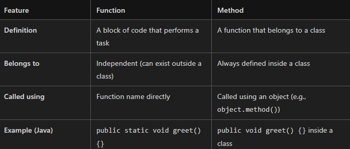
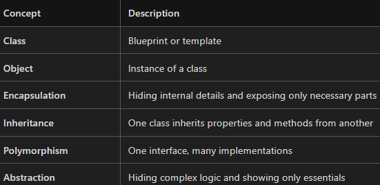

🌟 Object-Oriented Programming (OOP) Explained Simply

🔹 Programming Paradigms
Programming can be approached in different styles or methodologies:

Procedural Programming – Step-by-step instructions (like C).
Functional Programming – Focuses on functions and immutability (like Haskell).
Object-Oriented Programming (OOP) – Based on objects and classes (like C++, Java, Python).

🔹 What is OOP?
OOP is a programming concept that organizes software design around objects rather than functions and logic.

Most modern programming languages support OOP, including:
✅ C++
✅ Java
✅ Python
✅ C#
✅ Kotlin, Swift, and many more

🔹 Class vs Object
🧱 Class – The Blueprint
A class is like a blueprint or design plan. It defines:

Properties (also called data members or attributes)
Behaviors (also called methods or functions)
Example: Designing a Car on paper

Properties: color, number of seats (e.g., 4 seats), shape
Behaviors: move forward, turn headlights on, open doors

🚗 Object – The Real Thing
An object is a real-world implementation of a class. It is an instance of a class.

Example: Actually building the car using the blueprint

Now the car has real color, real seats, and can perform actions like driving.

🔹 Method vs Function – What’s the Difference?

✅ All methods are functions, but not all functions are methods.

🔹 Key Concepts in OOP

