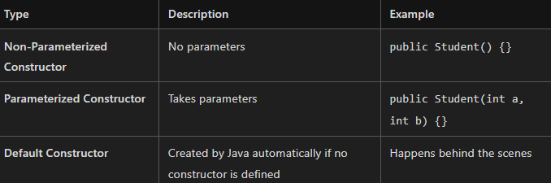

🌟 Object-Oriented Programming (OOP) Explained Simply

🔹 Programming Paradigms
Programming can be approached in different styles or methodologies:

Procedural Programming – Step-by-step instructions (like C).
Functional Programming – Focuses on functions and immutability (like Haskell).
Object-Oriented Programming (OOP) – Based on objects and classes (like C++, Java, Python).

🔹 What is OOP?
OOP is a programming concept that organizes software design around objects rather than functions and logic.

Most modern programming languages support OOP, including:\
✅ C++\
✅ Java\
✅ Python\
✅ C#\
✅ Kotlin, Swift, and many more

🔹 Class vs Object\
🧱 Class – The Blueprint\
A class is like a blueprint or design plan. It defines:

Properties (also called data members or attributes)
Behaviors (also called methods or functions)
Example: Designing a Car on paper

Properties: color, number of seats (e.g., 4 seats), shape
Behaviors: move forward, turn headlights on, open doors

🚗 Object – The Real Thing\
An object is a real-world implementation of a class. It is an instance of a class.

Example: Actually building the car using the blueprint

Now the car has real color, real seats, and can perform actions like driving.

🔹 Method vs Function – What’s the Difference?\

✅ All methods are functions, but not all functions are methods.

🔹 Key Concepts in OOP

🔹 Constructor in Java
🧱 What is a Constructor?
A constructor is a special method used to initialize objects when they are created.

🔧 Key Properties of Constructors:
1. Same name as the class
2. No return type (not even void)
3. Automatically called when an object is created
4. Used to initialize object data

Constructors Overloading:\
When we create multiple constructors in one class, it is called Constructors Overloading.
1. Argument list should not match.
2. Type of argument should be different.
3. Order of arguments may differ.
At least one of these must be there for constructor overloading.

Method Overloading:\
When we create multiple methods with the same name, it is called Method Overloading.
Having multiple methods in the same class with the same name.
1. Argument list should not match.
2. Type of argument should be different.
3. Order of arguments may differ.
At least one of these must be there for Method Overloading.

In overloading, return type does not create any difference.

this Keyword in OOPS:\
This refers to the current invoking object.
this(): used for the current class constructor from inside a different constructor of the same class.

Example:
class Test {
    public void show() {
        this.a;
    }
}
Test t = new Test();
t.show(); // here this refers to new Test() means t

Test t2 = new Test();
t2.show(); // here this refers to new Test() means t2

this refers to the current invoking object.

this(): calls the constructor depending upon the argument.
this(): this must be the first line/statement.

Inheritance in Java:\
Inheritance is the mechanism in Java by which one class is allowed to inherit the features of another class.

Example:
class Animal {
    void eat() {}
    void color() {}
} // Parent Class/Super Class/Base Class

class Dog extends Animal {
    // Dog inherits eat() and color() methods from Animal
} // Sub class/Child class/Derived Class

Types of Inheritance:
1. Single Inheritance: 1 parent and 1 child.
2. Multi-Level Inheritance.
3. Hierarchical Inheritance: 1 parent and multiple children.
4. Multiple Inheritance: 1 child and multiple parents (not supported using classes but can be supported using interfaces).
5. Hybrid Inheritance.
6. Cyclic Inheritance: Loop A extends A and is not supported in Java. A extends B, B extends A. In simple Java, cyclic inheritance is not supported.

super Keyword:\
Refers to the immediate parent class object.

super(): used to call the parent class constructor.
super(): this must be the first line/statement.
Used to call the parent class constructor from inside the child class constructor.

Overriding:\
Method Overriding:\
Overridden Method MohanLAL: public void eat(){//body}
Overriding Method Shyam: eat(){//body redefined by shyam}

parent method argumnet and child arugment shoul be same
and name also same
return type also same

If different return type: Co-Varient return type allowed. means narrodown we can do

//Public>protected>default>private

modifier: Child class accesibility we cant decrese we can increse bit not decrease.

Encapsulation: Wrapping of data members (variables) and methods(fucntions) in a single unit.

Class work as a wrapper
Class Test{
    private int a= 10;
    public void show(){

    }
}
Recommendations variable should be private
Thats why we have Getters and Setters
Data hiding
Incresed Security
Not directly accessable

Abstraction:
Abstract Class 
Interfaces

Showing features and hiding internal details or Implementations

Example:
CPU: ON/OFF we dont know how CPU on or off we dont the backend work
ATM: Return Money : Internally we dont know
Google Search Enginee: Best Search Result : Implementation hide

Features: Show 
Implementation: Hide

How to achive in Java?
100% abstraction: Must go for interfaces

0% - 100%: Provide abstraction- Abstract classes

abstract public void call();

Polymorphism:
Poly and morphs
many      forms

Compile time (Static binding) -> Overloading
runtime (Dynamic Binding) -> Overriding

Polymorphism with Example:

Polymorphism means many forms

poly(many) and Morph = Forms

Ability of an object to behave differently.

2 type: compile Time and run Time 

Complie Time: Object is bound with their functionality at the complie time

Achive with the help of Overloading

Run Time: Object is bound with their functionality at the run time.

Achive with the help of Overriding

