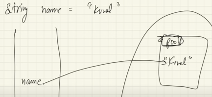
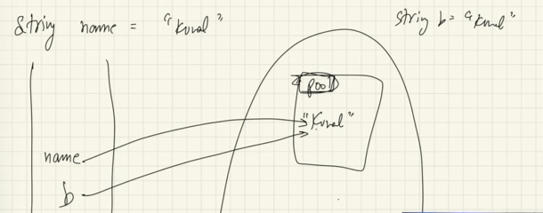
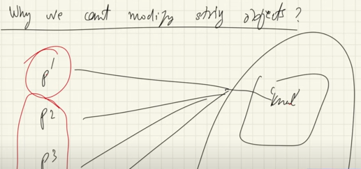
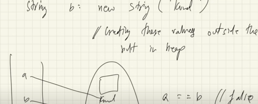

## 🧵 **String and StringBuilder in Java**

### ✅ **Basic Concepts**

- In Java, **everything that starts with a capital letter is a class**.
- Example:
  ```java
  String str = "Mukesh Dani";
  ```
  - `"Mukesh Dani"` → **String object** (stored in heap memory)
  - `str` → **Reference variable** (stored in stack memory)
  - `String` → **Data type**, which is actually a **class**

---

## 🔁 **String Pool**

### What is the String Pool?

- The **String Pool** is a special memory region inside the **heap**.
- It stores **unique string literals** to optimize memory usage.

### Example:
```java
String a = "Mukesh";
String b = "Mukesh";
```





- Both `a` and `b` point to the **same object** in the **String Pool**.
- Java checks if the string already exists in the pool:
  - If **yes**, it reuses the reference.
  - If **no**, it creates a new object in the pool.

---

## 🔒 **Immutability of Strings**

### Why are Strings Immutable?

- Once a `String` object is created, **its value cannot be changed**.
- This ensures:
  - **Security**
  - **Thread safety**
  - **Performance optimization** (especially with String Pool)
  


### Example:
```java
String name = "Mukesh";
name = "Dani"; // Creates a new object, doesn't modify the original
```

- The original `"Mukesh"` remains unchanged.
- A new object `"Dani"` is created, and `name` now points to it.

---

## 🔍 **String Comparison**

### 1. `==` Operator

- Compares **reference** (memory address).
- Checks if two variables point to the **same object**.

### 2. `.equals()` Method

- Compares **actual content** of the strings.
- Use this when you want to check **value equality**.

### Example:
```java
String a = "Mukesh";
String b = new String("Mukesh");

System.out.println(a == b);       // false (different objects)
System.out.println(a.equals(b));  // true (same content)
```

---

## 🧠 **Creating New String Objects**

### Example:
```java
String a = new String("Mukesh");
String b = new String("Mukesh");
```

- These are **two different objects** in the **heap**, not in the String Pool.
- Even though the content is the same, `a == b` will return `false`.

---

## 🧱 **StringBuilder vs String**

### Why use `StringBuilder`?

- `StringBuilder` is **mutable**.
- Ideal for **frequent modifications** (e.g., appending, inserting).
- More **efficient** than `String` for such operations.

### Example:
```java
StringBuilder sb = new StringBuilder("Mukesh");
sb.append(" Dani");
System.out.println(sb); // Mukesh Dani
```

---

## 🧮 **Memory Allocation in Java**

- **Primitive types** (e.g., `int`, `char`) → Stored in **stack memory**
- **Non-primitive types** (e.g., `String`, arrays, objects) → Stored in **heap memory**
- **Wrapper classes** (e.g., `Integer`, `Double`) → Stored in **heap**, but behave like objects

---

## 🔄 **Behind the Scenes: `valueOf()` and `toString()`**

- When printing any object, Java internally calls:
  - `String.valueOf()` → Converts to string
  - `toString()` → Returns string representation
- You can **override `toString()`** in your class to customize output.


# 🔍 Java String Internals

---

## 🧠 Understanding Java String Operations

### 🔹 Character vs String Addition

```java
System.out.println('a' + 'b');       // Output: 195
System.out.println("a" + "b");       // Output: ab
System.out.println((char)('a' + 3)); // Output: d
```

### Explanation:

- `'a' + 'b'` → Adds ASCII values: 97 + 98 = **195**
- `"a" + "b"` → Concatenates strings → **"ab"**
- `(char)('a' + 3)` → 97 + 3 = 100 → ASCII of 100 is **'d'**

---

## 🔄 Type Conversion in String Concatenation

```java
System.out.println("a" + 1); // Output: a1
```

- `1` is an `int`, but when added to a `String`, it's converted to `"1"` using `Integer.toString(1)`.

---

## 🧪 Complex Concatenation Examples

```java
System.out.println("Mukesh" + new ArrayList<>()); // Output: Mukesh[]
System.out.println("Mukesh" + new Integer(56));   // Output: Mukesh56

String ans = new Integer(56) + "" + new ArrayList<>();
System.out.println(ans); // Output: 56[]
```

### Key Insight:
- If **any operand is a String**, the result is a **String**.
- Java uses `toString()` on objects during concatenation.

---

## 🚫 Operator Overloading in Java

- Java **does not support operator overloading**.
- Languages like **C++** and **Python** do support it.

```java
System.out.println("a" + 'b'); // Output: ab
```

- `'b'` is converted to `"b"` → `"a" + "b"` → `"ab"`

---

## 🧠 String Pool and Performance

### 🔹 What is the String Pool?

- A special memory area in the **heap**.
- Stores **unique string literals** to save memory.
- Improves performance by **reusing existing strings**.

---

## 🐢 Performance Pitfall: String Concatenation in Loops

```java
String series = "";
for (int i = 0; i < 26; i++) {
    char ch = (char)('a' + i);
    series += ch;
}
```

### Problem:
- Each `+=` creates a **new String object**.
- Old string is copied → **Time complexity: O(n²)**
- **Memory inefficient**

---

## 🚀 Solution: Use `StringBuilder`

```java
StringBuilder builder = new StringBuilder();
for (int i = 0; i < 26; i++) {
    char ch = (char)('a' + i);
    builder.append(ch);
}
System.out.println(builder.toString()); // Output: abcdefghijklmnopqrstuvwxyz
```

** → No new object on each append.
- **Time complexity: O(n)** → Much faster and memory-efficient.

---

## 🧵 Summary of Key Concepts

| Concept                     | Explanation |
|----------------------------|-------------|
| `'a' + 'b'`                | Adds ASCII values |
| `"a" + 1`                  | Converts `1` to `"1"` |
| `String + Object`          | Calls `toString()` |
| String Pool                | Optimizes memory |
| Operator Overloading       | Not supported in Java |
| | Creates new object each time |
| `StringBuilder`            | Efficient, mutable |

---