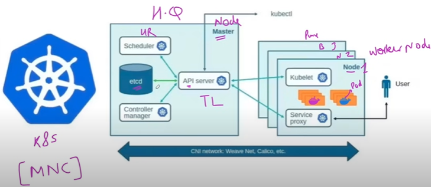

# 🚀 **Kubernetes Architecture Explained: From Google’s Challenge to Cloud-Native Revolution**

## 🌟 **Why Kubernetes? The Origin Story**

Back in the early 2000s, Google was running thousands of applications across millions of servers. Managing containers at this scale was a nightmare. They built an internal system called **Borg** to solve this — a powerful container orchestration tool that could:

- Automatically schedule workloads
- Heal failed applications
- Scale services based on demand

But Borg was internal. So in **2014**, Google open-sourced a simplified version called **Kubernetes** (Greek for "helmsman" or "pilot") to help the world manage containers like they did.

---

## 🧱 **Kubernetes Architecture Overview**

Kubernetes is made up of two main parts:

### 🔹 **1. Control Plane (Master Node)**
This is the brain of the cluster. It makes decisions and manages the overall state.

### 🔹 **2. Worker Nodes**
These are the hands — they run your actual applications inside containers.

---

## 🧠 **Control Plane Components (Master Node)**

### 📡 **API Server**
- **Simple:** The front desk of Kubernetes. All requests go through here.
- **Technical:** Exposes REST APIs. Validates and processes requests from `kubectl`, dashboards, or CI/CD tools.

### 📅 **Scheduler**
- **Simple:** Decides where new applications (pods) should run.
- **Technical:** Assigns pods to nodes based on resource availability, affinity, and constraints.

### 🔄 **Controller Manager**
- **Simple:** Ensures everything is running as expected.
- **Technical:** Runs controllers like Node Controller, Replication Controller, etc., to maintain desired state.

### 📘 **ETCD**
- **Simple:** A highly reliable notebook storing cluster data.
- **Technical:** Distributed key-value store that holds configuration, state, and metadata.

---

## ⚙️ **Worker Node Components**

### 🧑‍🏭 **Kubelet**
- **Simple:** The worker node’s manager.
- **Technical:** Communicates with the API Server, runs pods, and reports node health.

### 🐳 **Container Runtime**
- **Simple:** The engine that runs containers.
- **Technical:** Examples include Docker, containerd, CRI-O.

### 🔀 **Kube-Proxy**
- **Simple:** The traffic cop.
- **Technical:** Manages network rules, load balancing, and service discovery.

---

## 📦 **Pods & Containers**

- **Pod:** The smallest deployable unit in Kubernetes. Can contain one or more containers.
- **Container:** The actual application or service running inside a pod.

---

## 🌐 **Networking in Kubernetes**

Kubernetes uses **CNI (Container Network Interface)** plugins to manage networking.

### 🔌 **What is CNI?**
- **Simple:** A plugin system that connects containers to the network.
- **Technical:** Assigns IPs, sets up routing, and ensures isolation.

### 🧪 **Popular CNI Plugins**
- **Calico:** Secure networking with policies.
- **Flannel:** Simple overlay network.
- **Weave Net:** Easy setup with automatic IP management.
- **Cilium:** Advanced networking with eBPF.

---

## 🔄 **How Master & Worker Nodes Interact**

1. User sends a request via `kubectl`.
2. API Server receives and validates it.
3. Scheduler decides where to run the pod.
4. Controller Manager ensures pod creation.
5. Kubelet on the chosen worker node runs the pod.
6. Kube-Proxy sets up networking.

---

## ⚡ **Advanced Features of Kubernetes**

### 🔁 **Self-Healing**
- Automatically replaces failed containers.
- Restarts crashed pods.

### 📈 **Auto-Scaling**
- Scales applications based on CPU/memory usage.
- Horizontal Pod Autoscaler (HPA) adjusts pod count dynamically.

### 🔄 **Rolling Updates & Rollbacks**
- Update applications without downtime.
- Rollback if something breaks.

---

## 👤 **User Interaction Points**

- **kubectl CLI**
- **Kubernetes Dashboard**
- **CI/CD pipelines**
- **Monitoring tools (Prometheus, Grafana)**

All interact via the **API Server**.

---

## 🧭 **Summary Table**

| Component | Role | Simple Explanation |
|-----------|------|--------------------|
| API Server | Entry point | Talks to users/tools |
| Scheduler | Decision maker | Places pods on nodes |
| Controller Manager | Watchdog | Maintains desired state |
| ETCD | Database | Stores cluster data |
| Kubelet | Executor | Runs pods on nodes |
| Kube-Proxy | Network manager | Handles traffic |
| Pod | Unit | Holds containers |
| Container | App | Runs your code |
| CNI | Network plugin | Connects containers |

