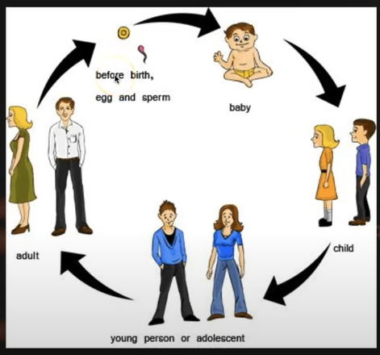
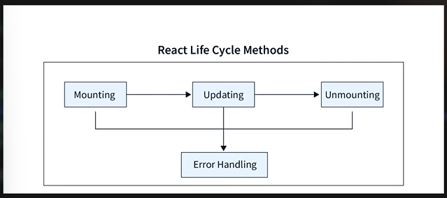
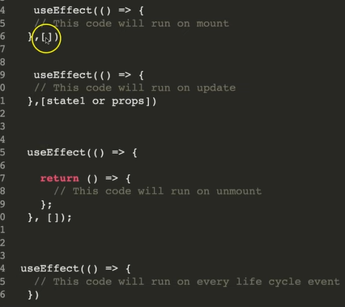

#### Life Cycle in Human
same in React

3 cycle must: 1. birh, 2. Young, 3. Expire 

#### Life cycle in ReactJS

Mounting: UI Rendering
Updating
Unmount

##### Mounting
useEffect(()=>{
    //This code will run on mount
}, [])

##### Updating
useEffect(()=>{
    // This code will run on update
}, [state1 or props])

#### Unmount
useEffect(()=>{
    
    return ()=>{
        //This code will run on unmount
    }

}, [])

useEffect(()=>{
    // This code will run on every life cycle
})
