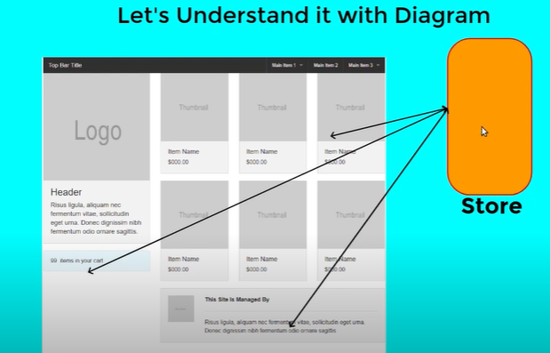
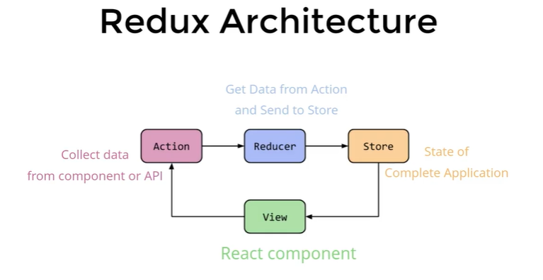

Redux

What is redux 
why we need it 
Understand it with diagram
How it work 

What is Redux:
A container where you can store your whole application data.
so we call it to state management
It does't belong to the component state


Why we need it?





### 🧩 **Redux Architecture: Simple Notes**

#### 1. **View (UI Components)**
- These are the visible parts of the app like:
  - Buttons
  - Images
  - Checkboxes
  - Colors
- When a user interacts with any of these (clicks, checks, etc.), an **event** is triggered.

#### 2. **Action**
- An **Action** is triggered by the event.
- Its job is to **collect data**.
- Data can be collected from:
  - The **View** (user input)
  - An **API** (external data)

#### 3. **Reducer**
- The **Action** sends the collected data to the **Reducer**.
- The Reducer receives the data and **processes it**.
- It then sends the updated data to the **Store**.

#### 4. **Store**
- The **Store** holds the **complete state** of the application.
- "State" means all the data your app needs to work.
- There should be **only one Store** in a Redux app.

#### 5. **Data Flow**
- Data in Redux flows in **one direction only**:
  - **View → Action → Reducer → Store → View**

---

### 🔁 Summary of Flow:
```
User interacts with View → Action is triggered → Data is collected → Reducer processes it → Store updates → View re-renders
```

---


## 🛠️ **Redux with React Setup Guide**

### ✅ Step 1: Check Node.js and npm
Make sure Node.js and npm are installed:

```bash
node -v
npm -v
```

If not installed, download from: https://nodejs.org

---

### ⚛️ Step 2: Create a React App

```bash
npx create-react-app my-app
cd my-app
```

This sets up a basic React project.

---

### 📦 Step 3: Install Redux

```bash
npm install redux
```

Redux is the core library for managing state.

---

### 🔗 Step 4: Install React-Redux

```bash
npm install react-redux
```

**React-Redux** is the official binding between React and Redux.  
It allows React components to access the Redux store and dispatch actions.

---

## 🔄 Bridging React and Redux

React and Redux are connected using **React-Redux**:

- `Provider`: Wraps your app and gives access to the Redux store.
- `useSelector`: Lets components read data from the store.
- `useDispatch`: Lets components send actions to the store.

### Example Setup:

```jsx
// index.js
import React from 'react';
import ReactDOM from 'react-dom';
import { Provider } from 'react-redux';
import store from './store';
import App from './App';

ReactDOM.render(
  <Provider store={store}>
    <App />
  </Provider>,
  document.getElementById('root')
);
```

---


Why we need it?
Probs:


