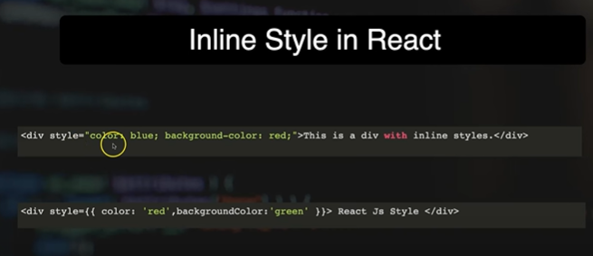

Styling React Using CSS

How many type of Style we have in ReactJS

1. Inline
2. External
3. CSS Modules
4. Styled Components:
5. External CSS Library/Framework

1. Inline Style: Use the style sttribute directly on your element
Bit different from basic css

2. External CSS
Make seperate file for css
And import to components

3. CSS Modules
Similar to external css file
But ensures that styles are locally scoped to a specific component

4. Styled Components
In React, styled-component is a library that allows you to write CSS direcly within your JS components
This approach is known as CSS-in-JS

5. Utility-First Libaries
Material UI
React Bootstrap
Tailwind CSS etc
